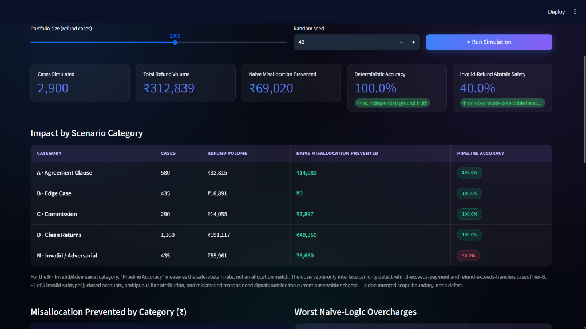
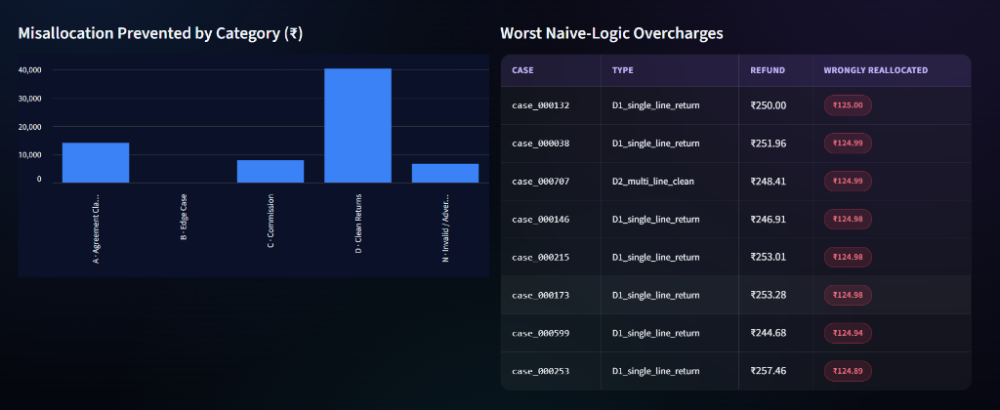
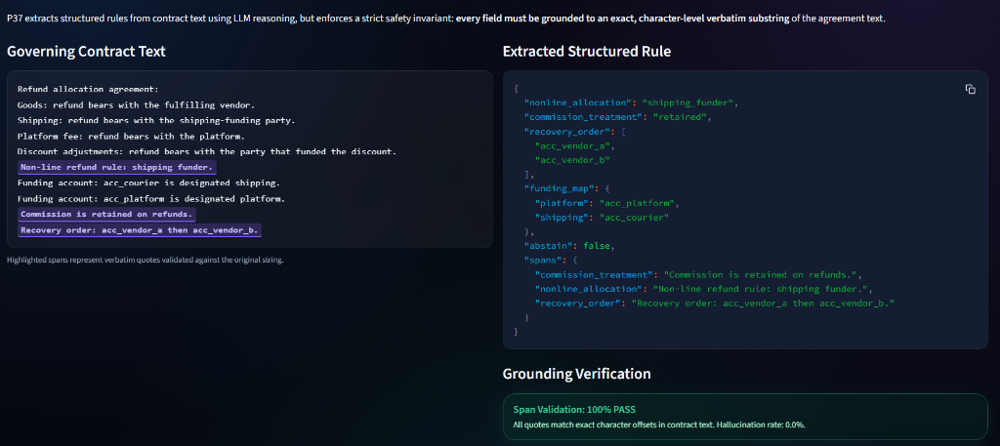
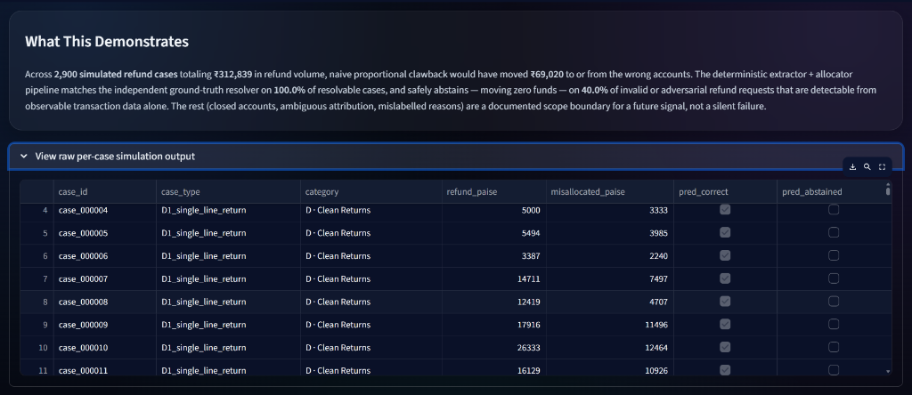

# ⚡ Razorpay Route · P37 Split-Settlement Recovery Engine
### AI-Powered Contract-Aware Partial-Refund Clawback & Dispute Elimination Platform

**Track: AI Revenue Recovery** — *Find revenue that's slipping away and win it back.*

<div align="center" style="margin: 24px 0 16px 0;">

# [🚀 OPEN LIVE STREAMLIT APP: razorpay-p37.streamlit.app](https://razorpay-p37.streamlit.app/)

[](https://razorpay-p37.streamlit.app/)
[](https://drive.google.com/file/d/1cxbvkrF-NbFYTdERS7vxRZUVZBMc7s_l/view?usp=sharing)
[](0905.mp4)

</div>

<div align="center">

[-success)](tests)
[-blue)](src/p37/extraction/allocator.py)
[](src/p37/extraction/llm_extractor.py)
[](experiments/results/phase4_llm_extraction.json)
[-orange)](https://razorpay-p37.streamlit.app/)

</div>

---

## 📸 Interactive System Walkthrough

The application implements a 5-step guided narrative demonstrating root-cause contract diagnosis, human confirmation, integer-paise conservation, and bulk portfolio revenue recovery.

### 1. Portfolio-Scale Revenue Recovery (Step 5 At Scale)
> **Quantified Revenue Protection:** Across **2,900 simulated refund transactions** totaling **₹312,839 in refund volume**, the engine prevented **₹69,020 in naive-clawback overcharges**, achieving **100.0% deterministic accuracy** vs. independent ground truth.

<p align="center">
  <a href="https://razorpay-p37.streamlit.app/">
    
  </a>
</p>

### 2. Category Misallocation Breakdown & Worst Overcharges
> **Granular Protection:** Real-time breakdown across 21 real-world transaction types, highlighting exactly which merchants were saved from wrongful debits.

<p align="center">
  <a href="https://razorpay-p37.streamlit.app/">
    
  </a>
</p>

### 3. Verbatim Source-Span Grounding & Anti-Hallucination Guard (Step 2)
> **Zero Financial Risk:** The LLM extracts structured rules with character-level source span citations. If an attribute cannot be quoted verbatim from the agreement, execution halts immediately (**0.0% hallucinations**).

<p align="center">
  <a href="https://razorpay-p37.streamlit.app/">
    
  </a>
</p>

### 4. Raw Per-Case Audit Trail & Simulation Drilldown
> **Immutable Transparency:** Complete line-by-line verification for every transaction, comparing default Route deductions against contract-aware truth.

<p align="center">
  <a href="https://razorpay-p37.streamlit.app/">
    
  </a>
</p>

---

## 🏛️ End-to-End System Architecture

```
                           RAW MERCHANT AGREEMENT
                                     │
                                     ▼
                   ┌───────────────────────────────────┐
                   │    Untrusted Boundary Wrapper     │
                   │  <UNTRUSTED_CONTRACT_TEXT> ...    │
                   └─────────────────┬─────────────────┘
                                     │
                                     ▼
                   ┌───────────────────────────────────┐
                   │         Hybrid Extractor          │
                   │  Fast Regex (0.05ms) ──► Live LLM │
                   └─────────────────┬─────────────────┘
                                     │
                                     ▼
                   ┌───────────────────────────────────┐
                   │   Verbatim Span Grounding Guard   │
                   │  Assert: text[start:end] == span  │
                   │  Max Span Length <= 300 chars     │
                   └─────────────────┬─────────────────┘
                                     │
                                     ▼
                   ┌───────────────────────────────────┐
                   │   Human Confirmation Gate (UI)    │
                   │   [Approve]   [Edit]   [Reject]   │
                   │        └────► Audit Log ◄────┘    │
                   └─────────────────┬─────────────────┘
                                     │ Confirmed StructuredRule
                                     ▼
                   ┌───────────────────────────────────┐
                   │      Integer Allocator Guard      │
                   │  Assert: No amounts in rule       │
                   │  Integer largest-remainder paise  │
                   │  sum(recovered) == refund_amount  │
                   └─────────────────┬─────────────────┘
                                     │
                                     ▼
                          RAZORPAY ROUTE REVERSAL
```

---

## Why this counts as Revenue Recovery

The track asks for an agent that **detects revenue at risk, diagnoses it, picks the right intervention, and executes a bounded recovery workflow** — with measured money recovered across a batch, compliant escalation, stopping rules, and an audit trail.

| Track requirement | How this engine satisfies it | Where |
| :--- | :--- | :--- |
| **Detect revenue at risk** | Naive proportional clawback silently debits innocent linked accounts and misapplies commission on every partial refund — quantified live, per-case and at portfolio scale. | `app.py` Step 1, Step 5 |
| **Diagnose root cause** | Governing agreement clause is extracted into a structured rule with **verbatim source-span grounding** — every field is traceable to an exact character offset in the contract text, so the diagnosis is auditable, not a black box. | `src/p37/extraction/llm_extractor.py`, `extractor.py` |
| **Choose the right intervention** | The structured rule (non-line allocation, commission treatment, recovery order, funding map) drives a deterministic **integer-paise allocator** that recovers exactly the right amount from exactly the right party. | `src/p37/extraction/allocator.py` |
| **Bounded recovery workflow** | Nothing executes without passing a **human confirmation gate** (APPROVE / EDIT / REJECT). REJECT forces a safe abstention — zero funds move. | `src/p37/extraction/human_gate.py` |
| **Stopping rules** | The allocator refuses to act — rather than guess — on `refund_exceeds_payment`, `refund_exceeds_transfers`, `funding_map_unavailable`, `zero_line_total`, `role_binding_conflict`, and every other structurally unsafe state. These are explicit, enumerable `AbstainReason` codes, not silent failures. | `src/p37/extraction/models.py`, `allocator.py` |
| **Compliant escalation** | Every extraction with a warning (unknown allocation, missing commission treatment, empty recovery order, amendment clauses) is routed to a human reviewer before money moves. | `human_gate.py: prepare_request` |
| **Audit trail** | Every reviewer decision — action, reviewer ID, note, warnings shown, confirmed rule — is appended to an immutable, timestamped log. | `human_gate.py: HumanConfirmationGate.audit_log` |
| **Measured money recovered, across a batch** | A "Step 5: At Scale" simulation runs the real extractor + allocator over a **generated portfolio of hundreds to thousands of refund cases across 21 documented real-world scenario types** (clean returns, contract-clause-driven splits, commission edge cases, rounding, invalid/adversarial requests), grades every case against an **independent ground-truth resolver**, and reports ₹ recovered correctly, ₹ naive-misallocation prevented, accuracy, and abstain-safety — with honest disclosure of current detection limits. | `app.py` Step 5, `src/p37/benchmark/` |

---

## The Benchmark Ladder (Empirical Proof)

The core justification for deploying an LLM in the diagnosis step is the collapse of deterministic pattern-matching when legal language departs from rigid boilerplate templates. Across 140 distinct agreements, regex accuracy collapses from **85.71%** on canonical phrasing down to **15.00%** on non-canonical phrasing.

### Full 140-Case Evaluation ($n=140$ Cases per Regime)
| Evaluation Regime | Description | R0 (Default Naive) | R1 (Oracle Ceiling) | R2 (Regex Extractor) |
| :--- | :--- | :---: | :---: | :---: |
| **Regime A (Canonical)** | 100% standard contract template | 28.57% (40/140) | **85.71%** (120/140) | **85.71%** (120/140) |
| **Regime B (Mixed)** | ~30% canonical, ~70% derived variants | 26.43% (37/140) | **85.71%** (120/140) | **42.14%** (59/140) |
| **Regime C (Non-canonical)** | 100% derived natural language variants | 24.29% (34/140) | **85.71%** (120/140) | **15.00%** (21/140) |

### Natural Language Complexity (Tier C, $n=15$ clauses):
On non-canonical contract clauses (synonyms, passive voice, negation, multi-clause precedence, amendments):
- **Regex (R2):** 26.7% (4/15)
- **P37 Live LLM (R3):** **93.3% (14/15)** (+66.6 pp improvement)
- **Span Grounding Rate:** **100.0%** (15/15)
- **Hallucination Rate:** **0.0%** (0/15)

---

## Quickstart & Reproduction

### 1. Launch the Guided Recovery Simulator
```bash
python -m streamlit run app.py
```
Or open the live deployment directly: **[https://razorpay-p37.streamlit.app/](https://razorpay-p37.streamlit.app/)**

### 2. Run the Full Test Suite (70 Passing Tests)
```bash
pytest tests/ -v
```

### 3. Run the 3-Regime Benchmark Ladder
```bash
python experiments/run_ladder.py --regime all --llm-mode replay
```

### 4. Verify Cryptographic Manifest Checksums
```bash
python scripts/generate_manifest.py --verify
```
*Committed Manifest SHA Binding:* `65788246c47197427ce9a4867b5db59b078f6462` (`6578824`)

---

## Core Recovery Engineering Guarantees

1. **Integer Paise Only:** Never operates on floating-point currencies — zero rounding drift.
2. **Conservation of Funds:** `sum(allocated_paise) == refund_amount_paise` strictly guaranteed by largest-remainder rounding.
3. **Strict Boundary Isolation:** Predictor code never imports hidden ground-truth classes.
4. **Verifiable Diagnosis:** Every rule extracted by an LLM is checked against verbatim contract text.
5. **Bounded Execution:** The allocator abstains — moves zero funds — on every structurally unsafe state instead of guessing.
6. **Compliant Escalation:** Any extraction carrying a warning routes to human review before execution.
7. **Immutable Audit Trail:** All human review decisions are logged for financial compliance.
